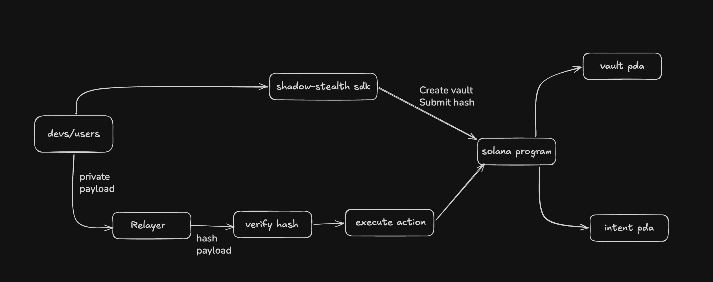

# Shadow SDK

Shadow SDK is a Solana private intent execution project.

It lets a user submit only a **hash** of an action on-chain, while the real
private payload stays off-chain with a relayer. The relayer verifies the payload
against the on-chain hash, executes it, and marks the intent as executed.

## Architecture



## Links

| Item | Link |
| --- | --- |
| Deployed program | `3Nz8wUHewqpMuceSLnoeTMyPLaDt9kNzsVMWTCeVMD6M` |
| Rust SDK crate | [`shadow-stealth`](https://crates.io/crates/shadow-stealth) |
| Relayer health | [`https://shadow-sdk-1.onrender.com/health`](https://shadow-sdk-1.onrender.com/health) |
| Architecture doc | [`docs/architecture/repository-structure.md`](docs/architecture/repository-structure.md) |
| Architecture | [`docs/architecture/architecture.png`](docs/architecture/architecture.png) |
| Web console | [`apps/web/`](apps/web/) |
| On-chain program | [`programs/stealth-vault/`](programs/stealth-vault/) |
| Rust SDK source | [`crates/stealth/`](crates/stealth/) |
| Relayer service | [`services/relayer/`](services/relayer/) |
| CLI | [`cli/`](cli/) |
| Examples | [`examples/`](examples/) |

## Main Pieces

- `stealth-vault`: Solana program for vaults and execution intents.
- `shadow-stealth`: Rust SDK for apps, CLI, and relayer integrations.
- `shadow-relayer`: off-chain service that verifies and executes private payloads.
- `apps/web`: demo console for creating and executing intents.
- `shadow-cli`: terminal tool for localnet/devnet testing.

## Quick Commands

Check the devnet program:

```bash
solana program show 3Nz8wUHewqpMuceSLnoeTMyPLaDt9kNzsVMWTCeVMD6M --url devnet
```

Install the SDK:

```bash
cargo add shadow-stealth
```

Run tests:

```bash
cargo test
```

Run the relayer:

```bash
cargo run -p shadow-relayer -- serve \
  --cluster devnet \
  --executor-keypair ~/.config/solana/ephemeral.json \
  --bind 127.0.0.1:8787
```
