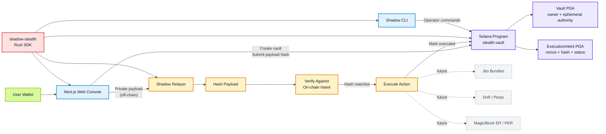

# Shadow SDK Architecture

Shadow SDK is a Solana private intent execution stack.

Users commit only a payload hash on-chain. The private payload stays off-chain
with the relayer, which verifies the hash before executing and marking the
intent complete.

## Deployment

| Item | Value |
| --- | --- |
| Network | Solana devnet |
| Program | `stealth-vault` |
| Program ID | `3Nz8wUHewqpMuceSLnoeTMyPLaDt9kNzsVMWTCeVMD6M` |
| Web console | Next.js app in `apps/web/` |
| Relayer API | Rust service in `services/relayer/` |

## Architecture



## Repository Map

```text
shadow-sdk/
├── apps/web/                 # Next.js demo console
├── cli/                      # operator/developer CLI
├── crates/stealth/           # shadow-stealth Rust SDK
├── docs/                     # architecture notes and runbooks
├── examples/                 # sample relayer configs and payloads
├── idl/stealth_vault.json    # checked-in Anchor IDL
├── programs/stealth-vault/   # Anchor on-chain program
└── services/relayer/         # off-chain intent verifier/executor
```

## What Each Part Does

| Path | Purpose |
| --- | --- |
| `programs/stealth-vault/` | On-chain Anchor program for vaults and execution intents. |
| `crates/stealth/` | Rust SDK for PDA derivation, payload hashing, instruction builders, and transactions. |
| `services/relayer/` | Verifies private payloads against on-chain hashes, executes actions, and marks intents executed. |
| `apps/web/` | Demo UI for wallet connection, vault setup, intent creation, queueing, and execution. |
| `cli/` | Terminal tool for local/devnet testing and operator commands. |
| `examples/` | Ready-to-use payloads and relayer config files. |
| `idl/` | Public program interface for SDKs and integrations. |

## Current Demo Flow

1. Connect wallet in the web console.
2. Create or refresh the user vault PDA.
3. Compose a private payload.
4. Submit only the payload hash to `stealth-vault`.
5. Send the private payload to the relayer.
6. Relayer verifies the hash, executes, and marks the intent executed.

## Built vs Future

Built:

- Vault PDA creation.
- Ephemeral authority rotation.
- Hashed intent submission.
- Intent cancel and execute lifecycle.
- Rust SDK, CLI, web console, and relayer API.
- Mock execution, system transfer support, and perps-shaped intent validation.

Future:

- Production Jito bundle adapter.
- Drift/perps execution adapter.
- MagicBlock ER/PER delegation and commit hooks.
- Hosted relayer hardening, auth, monitoring, and rate limits.
- TypeScript SDK package for frontend integrations.
